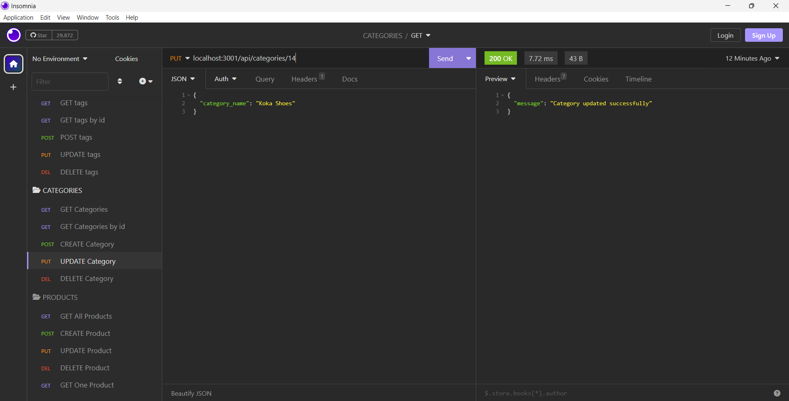
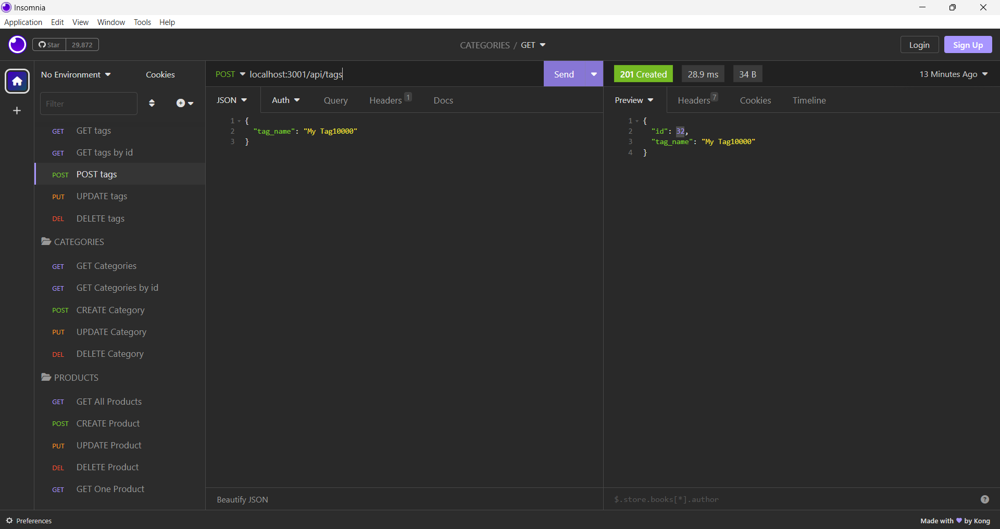
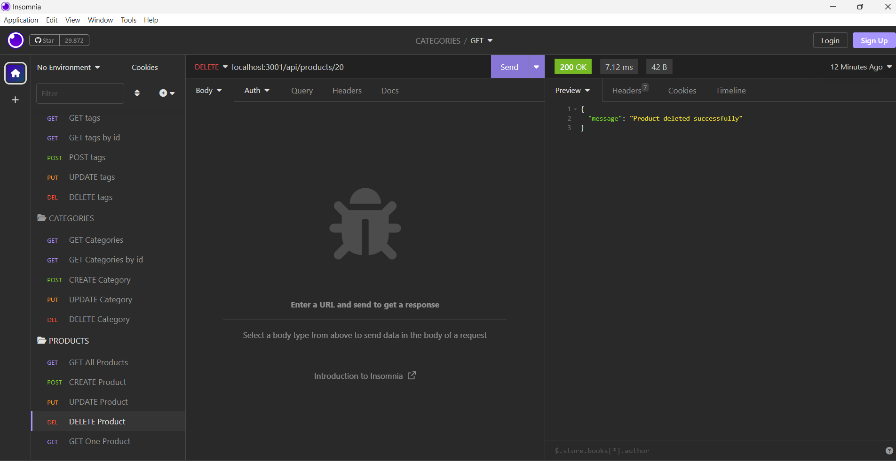

# My-EcommerceBackEnd1.1
  [](https://opensource.org/licenses/MIT)
 ## Description
 A backend implementation for an E-commerce application using Node.js and the Sequelize ORM library to interact with a MySQL database. It consists of route handlers that handle various API endpoints for managing products, categories, and tags in the E-commerce system.

 The code includes:

    Database Connection: A connection.js file establishes a connection to the MySQL database using Sequelize and loads environment variables using dotenv.

    Models: Sequelize models are defined for Product, Category, Tag, and ProductTag, representing different entities in the application and defining their table structures and relationships.

    Routes for Products: API routes (GET, POST, PUT, and DELETE) handle CRUD operations for products, including associating tags with products.

    Routes for Categories: There are API routes for managing categories, but the implementation is not shown in the provided code snippets.

    Routes for Tags: There are API routes for managing tags, but there seems to be an issue with the update route (PUT /api/tags/:id), causing a validation error.

    Seeding the Database: There's a seeds directory with seed data for categories, products, and tags, used to seed the database with initial data.

 Overall, the code provides the backend functionalities for an E-commerce application, allowing users to manage products, categories, and tags through API endpoints.

  ## Table of Contents
  - [Installation](#installation)
  - [Usage](#usage)
  - [License](#license)
  - [Deployed Link](#deployed-link)
  - [Sample Application](#sample-application)
  - [Questions](#questions)
  ## Installation <a name="installation"></a>

To run your E-commerce backend code with Sequelize and MySQL2, follow these steps for installation:

1. **Node.js and npm:**
   Make sure you have Node.js and npm (Node Package Manager) installed on your system. You can download them from the official Node.js website: https://nodejs.org

2. **Create a New Project:**
   Create a new directory for your project and navigate to it using the command line.

3. **Initialize npm:**
   Run the following command to initialize npm in your project directory. This will create a `package.json` file to manage your project's dependencies.

   ```bash
   npm init -y
   ```

4. **Install Required Packages:**
   Install the necessary packages for your project, including `express`, `sequelize`, `mysql2`, and `dotenv`. Run the following command:

   ```bash
   npm install express sequelize mysql2 dotenv
   ```

5. **Database Setup:**
   Ensure that you have a MySQL database set up and running. Create a new database for your E-commerce application and note down the connection details (database name, username, password, host, and port). You can use tools like phpMyAdmin or MySQL Workbench to manage your database.

6. **Configure Environment Variables:**
   Create a `.env` file in the root of your project directory and add the following environment variables with your database connection details:

   ```
   DB_NAME=your_database_name
   DB_USER=your_database_username
   DB_PW=your_database_password
   DB_HOST=your_database_host
   DB_PORT=your_database_port
   ```

   Replace `your_database_name`, `your_database_username`, `your_database_password`, `your_database_host`, and `your_database_port` with your actual database information.

7. **Create Sequelize Models:**
   Create Sequelize models for `Product`, `Category`, `Tag`, and `ProductTag` based on your desired database schema. Define their relationships and associations in the models.

8. **Define API Routes:**
   Implement the API routes for managing products, categories, and tags using Express.js. You can refer to the code you provided earlier for this.

9. **Run Database Migrations:**
   Run the following command to create the necessary tables in your database based on the Sequelize models:

   ```bash
   npx sequelize-cli db:migrate
   ```

10. **Run Database Seeds (Optional):**
    If you have seed data defined in the `seeds` directory, you can run the following command to populate the database with initial data:

    ```bash
    npx sequelize-cli db:seed:all
    ```

11. **Start the Server:**
    Start your E-commerce backend server by running the following command:

    ```bash
    node app.js
    ```

    Replace `app.js` with the filename where your Express application is defined.

12. **Test the API Endpoints:**
    Your E-commerce backend should now be up and running. You can test the API endpoints using tools like Insomnia or Postman.

That's it! You now have your E-commerce backend using Sequelize and MySQL2 set up and ready to handle requests from the frontend or other clients.

 
## Usage <a name="usage"></a>
  
To use your E-commerce backend code with Sequelize and MySQL2, follow these steps:

1. **Installation:**
   Install the required dependencies by running the following command in your project directory:

   ```bash
   npm install
   ```

2. **Database Setup:**
   Ensure that you have a MySQL database set up and running. Create a new database for your E-commerce application and note down the connection details (database name, username, password, host, and port). Update the `.env` file with these database connection details.

3. **Database Migration:**
   Create the necessary tables in your database based on the Sequelize models by running the migration command:

   ```bash
   npx sequelize-cli db:migrate
   ```

4. **Database Seeding (Optional):**
   If you have seed data defined in the `seeds` directory, you can populate the database with initial data by running the seed command:

   ```bash
   npx sequelize-cli db:seed:all
   ```

5. **Start the Server:**
   Run your E-commerce backend server using the following command:

   ```bash
   node app.js
   ```

6. **Testing the Endpoints:**
   Your E-commerce backend is now running, and it will be accessible at `http://localhost:3001` (or the port you have specified). You can test the API endpoints using tools like Insomnia, Postman, or by making HTTP requests from your frontend application.

For example, to retrieve all products, you can make a GET request to `http://localhost:3001/api/products`.

Similarly, you can use the defined routes for categories and tags by making requests to `http://localhost:3001/api/categories` and `http://localhost:3001/api/tags`, respectively.

Remember to include proper request bodies and headers when making POST, PUT, and DELETE requests, as specified in your API routes.

Please note that the actual filenames and directory structures may vary depending on your project setup. Make sure to adjust the commands and code accordingly to match your project's structure.

With these steps, you should be able to run and use your E-commerce backend successfully with Sequelize and MySQL2.
  
  ## License <a name="license"></a>
  This project is licensed under the MIT license.
  https://opensource.org/licenses/MIT
  
  ## Deployed Link <a name="deployed-link"></a>
  Walkthrough video demonstrating the functionality of the application : https://drive.google.com/file/d/15iyxKZ8P3CPJlFVJc1srx4ltApyNaEAr/view
  
  ## Sample Application <a name="sample-application"></a>
  
  
  
  

  ## Questions <a name="questions"></a>
  If you have any questions, please contact me at arun@arun.com. 
  
  My GitHub profile is [arundvp](https://github.com/arundvp).

